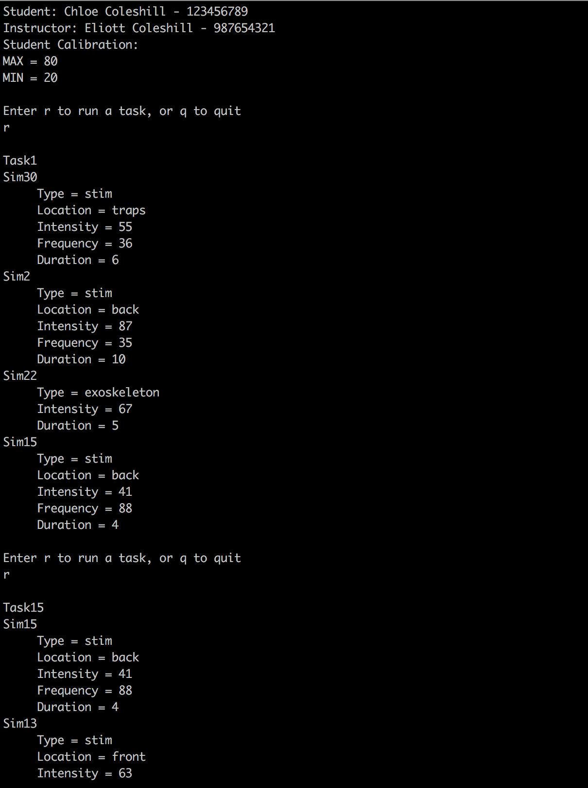

# araig-flightsim-console

This console app was developed as part of an applied research project between the School of Aviation and School of ICT at Seneca College to create an experimental shell program that could control a VR suit called ARAIG (this version does not directly interface with the suit) during the OOP in C++ course in the Bachelor of Technology program. The app reads in data from csv files that describe ARAIG stimulation and sensor readings, as well as data from a profile configuration file that states the order of execution for tasks to run for the suit. This project has a strong focus on OOP principles and C++ features such as STL containers, operator overloading, the rule of 5, etc.

The specifications pdf file contains more info about the project and learning outcomes for the course.

## Instructions

Note: This was compiled on a Linux system using g++

1. Navigate to the repo folder after cloning or downloading
2. Run `g++ -Wall -std=c++0x -O2 -o araigconsole Stims.cpp Exoskeleton.cpp Task.cpp ARAIG_Sensors.cpp Profile.cpp main.cpp`
3. Run `./araigconsole SampleProfileConfiguration.csv StimulationConfig.csv TaskConfiguration.csv output1.txt`

As the program executes, the output will be written to the terminal as well as to the output file.

## Screenshot

